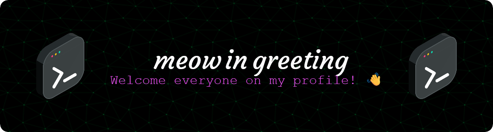
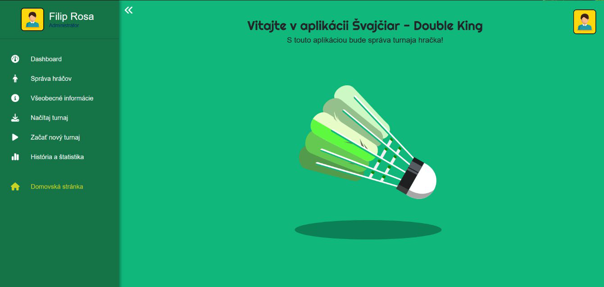

  From September 1, 2024, I started a new stage of my life - studying computer science at a university! I am interested in cybersecurity, data analysis and computer networks.

  
  

 

<h2>My projects</h2>

  

    
Švajčiar

  <h4>🏸Švajčiar - specialized web app for Swiss doubles in badminton</h4>

  [//]: 

  Single-page web application for badminton tournaments management in compliance with REACT API standards created by React and Django frameworks with MySQL database. User can manage tournament - from entering and drawing players to evaluating and printing results. It is also possible to view all played tournaments. The frontend is deployed on web hosting and the backend on PythonAnywhere.

  --

  🔧 **Technologies:** React, Django, MySQL, Tailwind CSS
  
  📦 **Preview:** [web page](https://svajciar.spsit.sk)
  

 

<h2>About me</h2>

From September 1, 2024, I started a new stage of my life - studying at a university! 🎓

<b>Subjects studied:</b>

  
In the first semester:

  
  - 🔌 Safety in Electrical Engineering I  
  - ⌨️ Functional Programming (Haskell)  
  - 🌐 English Language for FEI - intermediate  
  - 🧮 Linear Algebra  
  - ⚖️ Law in Computer Science  
  - 🏸 Physical Education (badminton)  
  - 💭 Introduction to Logical Thinking  
  - ⌨️ Introduction to Programming (C)  
  - 🖥️ Introduction to Digital Systems  

  
In the second semester:

  
  - 🖥️ Algorithms I  
  - 💽 Computer Architecture and Parallel Systems  
  - 🌐 English Language for FEI - intermediate  
  - 🧮 Mathematical Analysis 1  
  - ⌨️ Object Oriented Programming (C++)  
  - 📰 Typography of Technical Documents (LaTeX)  
  - 👨‍💼 Soft Skills  
  - 🏸 Physical Education (badminton)  
  - 📊 Introduction to Software Engineering

  
In the third semester:

  
  - 🖥️ Algorithms II  
  - 📊 Database Systems I  
  - 🧮 Discrete Mathematics  
  - 🌐 English Language for FEI - intermediate  
  - 🧮 Mathematical Analysis 2  
  - 🖥️ Computer Networks  
  - ⌨️ Java Programming I  
  - 🏸 Physical Education (badminton)  
  - 📊 Introduction to Social Network Analysis

  
In the fourth semester:

  - 🖥️ Administration of Operating Systems  
  - ⌨️ C++ Programming I  
  - 📊 Database Systems II  
  - 🖥️ Design of Applications for Mobile Devices I  
  - 🌐 English Language for FEI - intermediate  
  - 💭 Introduction to Theoretical Computer Science  
  - ⌨️ Java Programming II  
  - 🏸 Physical Education (badminton)  
  - ⌨️ Scripting Languages  
  - 📊 Software Project Management  
  - ⌨️ User Interfaces

#### Computer science skills:

##### Languages

    

##### Frameworks, programms & services

    

##### IDE and editors

    

##### OS

    

---

  
    
  
    
  
      
  

